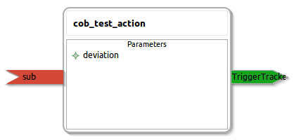

cob_test_action
====================

General description
---------------------
The cob_test_action package

Node: cob_test_action
---------------------
#### Parameters
**deviation** *(int, default: 10)*
<!--- protected region deviation on begin -->
<!--- protected region deviation end -->

#### Published Topics

#### Subscribed Topics
**sub** *(std_msgs::String)*   
<!--- protected region sub on begin -->
<!--- protected region sub end -->

