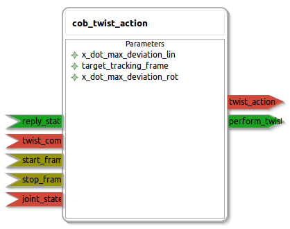

cob_twist_action
====================

General description
---------------------
The cob_twist_action package

Node: cob_twist_action
---------------------
#### Parameters
**x_dot_max_deviation_lin** *(double, default: 1.0)*
<!--- protected region x_dot_max_deviation_lin on begin -->
<!--- protected region x_dot_max_deviation_lin end -->

**target_tracking_frame** *(string, default: )*
<!--- protected region target_tracking_frame on begin -->
<!--- protected region target_tracking_frame end -->

**x_dot_max_deviation_rot** *(double, default: 3.15)*
<!--- protected region x_dot_max_deviation_rot on begin -->
<!--- protected region x_dot_max_deviation_rot end -->

#### Published Topics
**twist_action** *(geometry_msgs::Twist)*   
<!--- protected region twist_action on begin -->
<!--- protected region twist_action end -->

#### Subscribed Topics
**twist_command** *(geometry_msgs::Twist)*   
<!--- protected region twist_command on begin -->
<!--- protected region twist_command end -->

**joint_state_reader** *(sensor_msgs::JointState)*   
<!--- protected region joint_state_reader on begin -->
<!--- protected region joint_state_reader end -->

